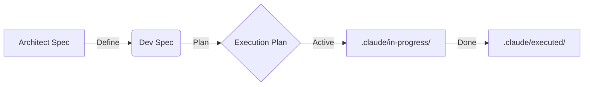

# Spec-Driven AI (Workflow for Claude Code)

> **A markdown-based state management system to prevent "Context Rot" in large LLM-generated projects.**

[](https://anthropic.com/claude)
[](https://opensource.org/licenses/MIT)

## 🛑 The Problem: "Context Rot"

When building large projects with AI coding assistants (like Claude Code), you typically hit a wall after 3-4 days of development:

1.  **Context Loss:** The LLM forgets *why* a file was created or what the architectural goal was.
2.  **Looping:** It starts rewriting the same code because it lost the execution plan.
3.  **Ghost Code:** You end up with orphaned files and don't know if they are still needed.

**The cause?** Chat sessions are ephemeral. Your project state is not.

## ⚡ The Solution: 3-Phase State Management

This repository implements a **Spec-Driven Workflow** that forces Claude to track its own state using markdown files directly in your project. It moves every feature through three strict phases:



1.  **Planning (`.claude/specs/plans/`)**: High-level architectural decisions and "Why we are building this."
2.  **In-Progress (`.claude/specs/in-progress/`)**: The active "Context Anchor" for the current session.
3.  **Executed (`.claude/specs/plans-executed/`)**: A permanent audit trail. **6 months later**, you can read exactly *why* code was written.

> **Why this works:** Markdown files are "context-cheap" for LLMs to read, whereas re-reading your entire codebase to guess the state is "context-expensive" and error-prone.

---

## 📂 Free Resources in this Repo

We have open-sourced the core methodology and prompt engineering files so you can implement this workflow manually.

### 1. The Core Rules
* **[`CLAUDE.md`](./CLAUDE.md)**: The "Brain" of the system. Drop this file into your project root. It instructs Claude Code to check `.claude/specs/` before writing code and enforces the 3-step workflow.

### 2. Spec Generators (Prompt Engineering)
* **[`prompts/architect-spec-generator-prompt.md`](./prompts/architect-spec-generator-prompt.md)**: Generates high-level system design (API Contracts, Security, Data Flow).
* **[`prompts/development-spec-generator-github-prompt.md`](./prompts/development-spec-generator-github-prompt.md)**: Converts the architect spec into actionable, step-by-step coding tasks.

### 3. Specialized Skills & Agents
* **[`skills/spring-boot-unit-test.md`](./skills/spring-boot-unit-test.md)**: An advanced skill that detects your project's testing patterns (BaseTest, TestDataBuilder) and writes JUnit 5 tests automatically.
* **[`agents/java-code-reviewer.md`](./agents/java-code-reviewer.md)**: An agent definition that auto-activates on `.java` file edits to check for OWASP security issues and performance bottlenecks.
* **[`agents/api-test-reviewer.md`](./agents/api-test-reviewer.md)**: Auto-reviews your Controller tests for coverage gaps and assertion quality.

---

## 🚀 How to Use (The Protocol)

### Step 1: Install the Rules
Copy `CLAUDE.md` to your project root. Create the folder structure:
```bash
mkdir -p .claude/specs/{plans,in-progress,plans-executed}
```

### Step 2: Generate a Spec
Use the provided prompts to create your first feature spec.
* **Input:** "I need a User API for registration."
* **Output:** Save the result to `.claude/specs/user-api.md`.

### Step 3: Execute with State
Ask Claude:
> *"Read the spec in `.claude/specs/user-api.md` and create an execution plan."*

Claude will now:
1.  Create a plan in `.claude/specs/plans/`.
2.  Move items to `.claude/specs/in-progress/` as it works.
3.  Move the final log to `.claude/specs/plans-executed/` when done.

---

## 🛠 The Spec-Driven Toolkit (Optional Automation)

While you can use the methodology above manually, we have built a **CLI Toolkit** to automate the friction.

**The Full Toolkit ($49) includes:**

* ⚡ **Session Commands:** `/session-start`, `/session-update`, `/session-end` (auto-generates git summaries and todo lists).
* 🤖 **Auto-Reviewers:** The full suite of Agents (`java-code-reviewer`, `api-test-reviewer`) configured to auto-activate on file save.
* 🧪 **Test Generator:** The complete `spring-boot-unit-test` skill + 6 reference guides for different testing scenarios.
* 🛠 **Git Helpers:** Conventional commit generators and branch managers.

[**Get the Full Toolkit on Gumroad →**](https://hathwar.gumroad.com/l/spec-driven-ai)

---

## License
The files in this repository are available under the MIT License.
